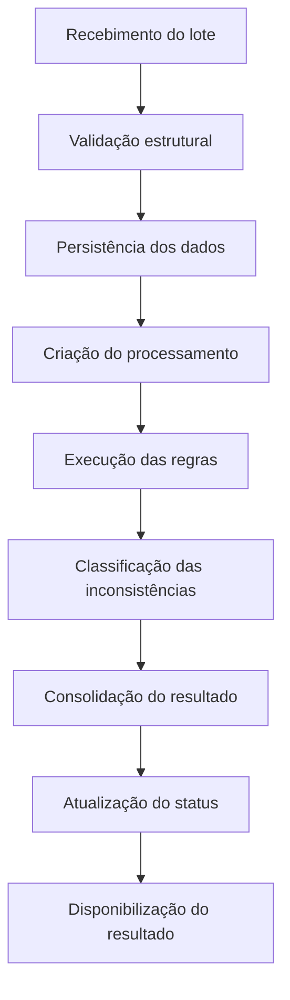
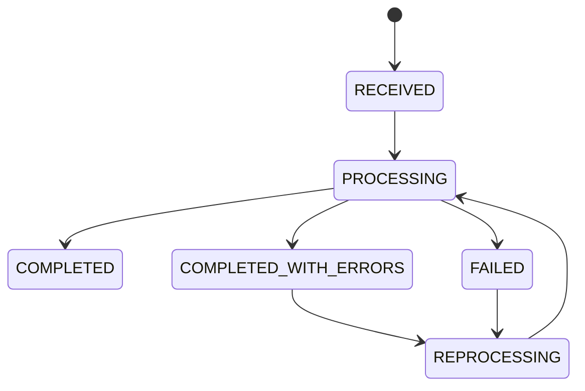

# RegulaFlow

Plataforma de processamento e validação de operações financeiras.

**Versão:** 1.0 · **Status:** Em desenvolvimento · **Tipo:** Projeto de portfólio

> Dados e regras fictícios, para fins educacionais e de demonstração técnica. Este projeto não representa uma implementação oficial de nenhum leiaute ou norma do Banco Central.

## Sumário

1. [Visão geral](#visão-geral)
2. [Problema de negócio](#problema-de-negócio)
3. [Objetivo do produto](#objetivo-do-produto)
4. [Objetivos de negócio](#objetivos-de-negócio)
5. [Escopo](#escopo)
6. [Fora do escopo](#fora-do-escopo)
7. [Personas](#personas)
8. [Fluxo de negócio](#fluxo-de-negócio)
9. [Estados do processamento](#estados-do-processamento)
10. [Requisitos funcionais](#requisitos-funcionais)
11. [Severidade das validações](#severidade-das-validações)
12. [Requisitos não funcionais](#requisitos-não-funcionais)
13. [Regras de negócio](#regras-de-negócio)
14. [Critérios de aceite](#critérios-de-aceite)
15. [Indicadores de negócio](#indicadores-de-negócio)
16. [Benefícios esperados](#benefícios-esperados)
17. [Riscos](#riscos)
18. [Evoluções futuras](#evoluções-futuras)
19. [MVP](#mvp)
20. [Definição de pronto](#definição-de-pronto)
21. [Resultado esperado](#resultado-esperado)
22. [Stack tecnológica](#stack-tecnológica)
23. [Posicionamento](#posicionamento)

## Visão geral

O RegulaFlow processa, valida e monitora operações financeiras, com foco na identificação antecipada de inconsistências em dados que serão usados em processos regulatórios e operacionais.

A solução simula uma instituição financeira que recebe grandes volumes de informações de sistemas diferentes e precisa garantir que os dados estejam completos, consistentes e aderentes às regras de negócio antes de seguirem para as etapas posteriores.

O sistema recebe lotes de operações, executa validações automaticamente, registra inconsistências, acompanha o processamento e disponibiliza informações para análise e reprocessamento.

## Problema de negócio

Processos financeiros e regulatórios dependem de informações de múltiplas fontes. Erros nesses dados podem gerar:

- rejeição de arquivos;
- necessidade de reprocessamento;
- inconsistências entre sistemas;
- aumento do volume de chamados;
- trabalho operacional manual;
- atrasos no processamento;
- dificuldade para identificar a origem de uma inconsistência;
- perda de rastreabilidade.

Quando as validações acontecem somente perto da etapa final, o custo para identificar e corrigir os problemas aumenta.

O RegulaFlow trata esse problema com a validação automatizada e rastreável das operações antes que elas avancem no fluxo operacional.

## Objetivo do produto

1. Receber lotes de operações financeiras.
2. Validar a estrutura e os dados recebidos.
3. Executar regras de negócio.
4. Identificar e classificar inconsistências.
5. Registrar o resultado das validações.
6. Permitir o acompanhamento do processamento.
7. Permitir o reprocessamento de lotes.
8. Disponibilizar informações para análise operacional.
9. Fornecer métricas de processamento e qualidade dos dados.

## Objetivos de negócio

### Reduzir erros

Identificar inconsistências automaticamente antes que os dados avancem para as próximas etapas.

### Reduzir trabalho manual

Automatizar validações que poderiam depender de conferência manual.

### Aumentar rastreabilidade

Permitir identificar:

- qual lote foi processado;
- quando foi processado;
- quantos registros foram processados;
- quais regras falharam;
- quais registros apresentaram problemas;
- qual foi o resultado do processamento.

### Melhorar a capacidade operacional

Processar grandes volumes de registros sem exigir que uma pessoa acompanhe cada execução manualmente.

### Facilitar a sustentação

Disponibilizar informações suficientes para que uma equipe técnica investigue falhas e inconsistências.

## Escopo

Esta versão contempla:

- recebimento de lotes;
- cadastro de operações;
- validação estrutural;
- validação de regras de negócio;
- classificação de erros;
- processamento assíncrono;
- acompanhamento do status;
- histórico de processamentos;
- reprocessamento;
- geração de resultados;
- logs;
- métricas;
- auditoria das execuções.

## Fora do escopo

Ficam para evoluções futuras:

- envio real de informações ao Banco Central;
- utilização de dados reais de instituições financeiras;
- implementação integral de leiautes regulatórios oficiais;
- autenticação integrada a sistemas corporativos;
- aprovação humana de operações;
- cálculo contábil;
- liquidação financeira;
- integração com sistemas bancários reais.

## Personas

### Analista operacional

Acompanha os processamentos e analisa inconsistências.

- Saber se um lote foi processado.
- Identificar erros.
- Consultar registros problemáticos.
- Gerar informações para correção.
- Acompanhar reprocessamentos.

### Analista de negócio e regulatório

Acompanha a qualidade das informações e das regras usadas no processo.

- Identificar quais regras apresentam maior volume de erros.
- Acompanhar a qualidade dos dados.
- Analisar tendências.
- Consultar o histórico de validações.

### Desenvolvedor

Mantém e evolui o sistema.

- Identificar falhas.
- Consultar logs.
- Acompanhar métricas.
- Reproduzir problemas.
- Adicionar novas regras.
- Realizar alterações com segurança.

### Analista de sustentação

Acompanha a operação da aplicação.

- Verificar disponibilidade.
- Identificar processamento parado.
- Acompanhar falhas.
- Verificar filas.
- Consultar o histórico de execuções.

## Fluxo de negócio



## Estados do processamento

Cada lote possui um status.



| De | Para | Quando |
| --- | --- | --- |
| `RECEIVED` | `PROCESSING` | O processamento é iniciado |
| `PROCESSING` | `COMPLETED` | O lote termina sem inconsistência |
| `PROCESSING` | `COMPLETED_WITH_ERRORS` | O lote termina com inconsistências registradas |
| `PROCESSING` | `FAILED` | Uma falha técnica impede a conclusão |
| `FAILED` ou `COMPLETED_WITH_ERRORS` | `REPROCESSING` | O usuário solicita uma nova execução |
| `REPROCESSING` | `PROCESSING` | A nova execução começa e o histórico da tentativa anterior permanece disponível |

## Requisitos funcionais

### RF001 — Receber lote

O sistema permite o recebimento de um lote de operações financeiras.

**Entrada**

- identificador do lote;
- nome do arquivo;
- data de referência;
- operações.

**Resultado**

O sistema registra o lote e disponibiliza seu processamento.

### RF002 — Validar estrutura

O sistema valida a estrutura dos dados recebidos.

Exemplos:

- campos obrigatórios;
- tipos de dados;
- formatos;
- datas;
- valores;
- identificadores.

### RF003 — Validar regras de negócio

O sistema executa regras configuradas para identificar inconsistências.

Exemplos fictícios:

| Código | Regra | Severidade |
| --- | --- | --- |
| VAL001 | Campo obrigatório ausente | ERROR |
| VAL002 | Valor inválido | ERROR |
| VAL003 | Data fora do período permitido | WARNING |
| VAL004 | Operação duplicada | ERROR |
| VAL005 | Valor deve ser maior que zero | ERROR |
| VAL006 | Identificador inválido | ERROR |

### RF004 — Registrar inconsistências

Toda inconsistência possui:

- código da regra;
- descrição;
- severidade;
- operação relacionada;
- lote;
- data e hora da ocorrência.

### RF005 — Consultar processamento

A consulta de um processamento expõe:

- identificador do lote;
- arquivo;
- status;
- data de início;
- data de término;
- quantidade de registros;
- quantidade de erros;
- quantidade de warnings.

### RF006 — Consultar inconsistências

A consulta filtra inconsistências por:

- lote;
- operação;
- código da regra;
- severidade;
- período.

### RF007 — Reprocessar lote

O sistema permite reprocessar lotes elegíveis. O reprocessamento gera um novo evento de execução e preserva o histórico da tentativa anterior.

### RF008 — Processamento assíncrono

Processamentos que possam demorar rodam de forma assíncrona. O usuário recebe o identificador do processamento e consulta o status depois.

### RF009 — Auditoria

O sistema mantém histórico das principais ações. Exemplos:

- lote recebido;
- processamento iniciado;
- regra `VAL001` executada;
- processamento finalizado;
- processamento reprocessado.

### RF010 — Monitoramento

O sistema disponibiliza métricas de processamento:

- quantidade de lotes processados;
- quantidade de falhas;
- quantidade de registros processados;
- quantidade de inconsistências;
- tempo médio de processamento;
- quantidade de reprocessamentos.

## Severidade das validações

### ERROR

Impede que o registro seja considerado válido.

Exemplo: operação sem identificador.

### WARNING

Indica uma situação que deve ser analisada e não impede o processamento por si só.

Exemplo: operação fora do período esperado.

### INFO

Informação gerada durante o processamento.

Exemplo: operação processada com sucesso.

## Requisitos não funcionais

### RNF001 — Disponibilidade

A aplicação possui health check para verificar sua disponibilidade.

### RNF002 — Observabilidade

A aplicação produz logs estruturados e métricas que permitem investigar problemas operacionais.

### RNF003 — Performance

O processamento lida com grandes quantidades de registros sem bloquear as requisições HTTP durante operações demoradas.

### RNF004 — Segurança

Dados sensíveis ficam fora dos logs. Credenciais são configuradas por variáveis de ambiente.

### RNF005 — Manutenibilidade

As regras de negócio são modulares. Uma regra nova entra sem alteração significativa do fluxo principal.

### RNF006 — Testabilidade

As principais regras de negócio possuem testes automatizados.

## Regras de negócio

| ID | Regra |
| --- | --- |
| RN001 | Toda operação possui um identificador único. |
| RN002 | O valor de uma operação é maior que zero. |
| RN003 | A mesma operação não é processada duas vezes dentro do mesmo lote. |
| RN004 | A data da operação está em formato válido. |
| RN005 | Toda inconsistência está relacionada a uma operação e a um lote. |
| RN006 | A mesma solicitação de processamento não gera múltiplos processamentos equivalentes. |

## Critérios de aceite

### Cenário 1 — Lote válido

**Dado** um lote com operações válidas  
**Quando** o processamento for executado  
**Então** o lote é finalizado como `COMPLETED`.

### Cenário 2 — Lote com inconsistências

**Dado** um lote com operações inválidas  
**Quando** o processamento for executado  
**Então** as inconsistências são registradas  
**E** o lote é finalizado como `COMPLETED_WITH_ERRORS`.

### Cenário 3 — Falha técnica

**Dado** que ocorra uma falha durante o processamento  
**Quando** o processamento não puder ser concluído  
**Então** o lote é marcado como `FAILED`.

### Cenário 4 — Reprocessamento

**Dado** um lote que apresentou falha  
**Quando** o usuário solicitar o reprocessamento  
**Então** uma nova execução é criada  
**E** o histórico da execução anterior permanece disponível.

## Indicadores de negócio

### Taxa de sucesso

```text
processamentos concluídos
───────────────────────── × 100
total de processamentos
```

### Taxa de erro

```text
processamentos com erro
─────────────────────── × 100
total de processamentos
```

### Taxa de inconsistência

```text
registros com erro
────────────────── × 100
registros processados
```

### Tempo médio de processamento

Tempo médio entre o início e o término dos processamentos.

## Benefícios esperados

- redução de validações manuais;
- identificação antecipada de inconsistências;
- maior rastreabilidade;
- redução de retrabalho;
- maior previsibilidade operacional;
- facilidade para investigação de incidentes;
- histórico dos processamentos;
- maior qualidade dos dados.

## Riscos

### Volume elevado

Grandes lotes podem aumentar o tempo de processamento.

**Mitigação:** processamento assíncrono e possibilidade de evolução para processamento paralelo.

### Regras complexas

O aumento das regras pode tornar o código difícil de manter.

**Mitigação:** arquitetura modular e separação das regras de domínio.

### Falha durante o processamento

Uma falha pode deixar o processamento incompleto.

**Mitigação:** controle de estados, retry, logs e idempotência.

### Dados inconsistentes

Dados de origem podem apresentar problemas inesperados.

**Mitigação:** validação estrutural antes do processamento das regras de negócio.

## Evoluções futuras

- painel web;
- autenticação e autorização;
- RBAC;
- versionamento das regras;
- configuração de regras sem alteração de código;
- notificações;
- integração com sistemas externos;
- processamento distribuído;
- armazenamento de arquivos;
- geração automática de relatórios;
- trilha de auditoria mais completa;
- filas distribuídas;
- infraestrutura em cloud.

## MVP

A primeira versão contém o essencial:

- API FastAPI
- PostgreSQL
- cadastro de lotes
- cadastro de operações
- validações
- registro de erros
- consulta de processamento
- testes automatizados
- Docker
- documentação Swagger

Depois do MVP:

- Celery
- Redis
- retry
- idempotência
- observabilidade
- Prometheus
- Grafana
- CI/CD

## Definição de pronto

Uma funcionalidade está concluída quando:

- está implementada;
- possui testes;
- possui tratamento de erros;
- está documentada;
- não introduz regressões;
- está disponível para execução local através do Docker;
- possui código revisado e formatado.

## Resultado esperado

Ao final, o RegulaFlow demonstra a capacidade de construir uma aplicação backend Python orientada a um problema de negócio realista:

**API + regras de negócio + banco de dados + processamento assíncrono + testes + observabilidade + documentação + práticas de engenharia de software.**

O objetivo do projeto de portfólio é demonstrar análise de negócio, modelagem, desenvolvimento backend, qualidade de código, tratamento de falhas e visão de produção.

## Stack tecnológica

| Camada | Tecnologia |
| --- | --- |
| Linguagem | Python |
| API | FastAPI |
| Validação | Pydantic |
| ORM | SQLAlchemy |
| Banco | PostgreSQL |
| Migração | Alembic |
| Mensageria | Redis |
| Jobs | Celery |
| Testes | Pytest |
| Qualidade | Ruff + MyPy |
| Containerização | Docker |
| Observabilidade | Prometheus + Grafana |
| CI/CD | GitHub Actions |
| Documentação da API | OpenAPI / Swagger |

## Posicionamento

O RegulaFlow aplica engenharia de software, desenvolvimento backend Python, sistemas financeiros, processamento de dados, automação, validação de informações e sustentação de aplicações.

A arquitetura permite evolução gradual: começa modular e pode incorporar processamento distribuído, integrações externas e componentes adicionais conforme a escala e o negócio pedirem.
